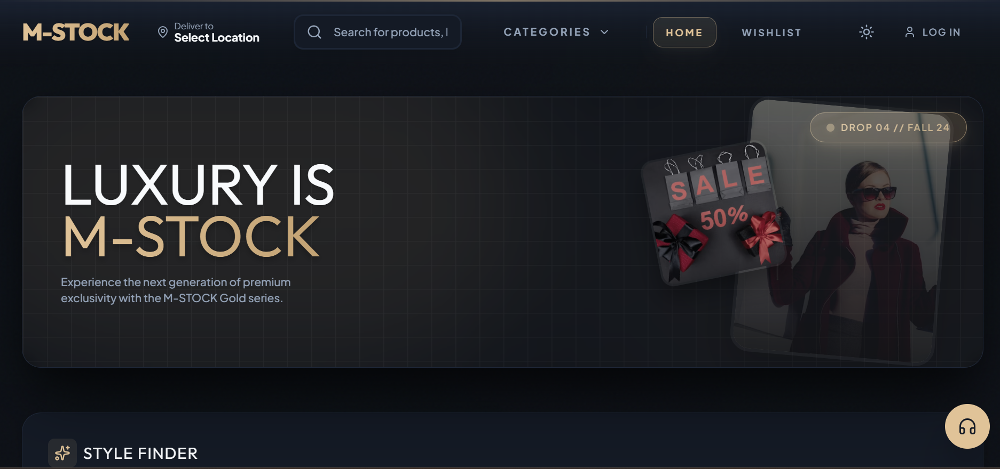

<p align="center">
  
</p>

<h1 align="center">
Hi 👋, I'm Murli Manohar Kumar
</h1>

<h3 align="center">
Aspiring Data Scientist • Machine Learning Enthusiast • AI Learner
</h3>

<p align="center">

</p>

<p align="center">

🎓 B.Tech Student &nbsp; • &nbsp;
🐍 Python Developer &nbsp; • &nbsp;
📊 Data Science Enthusiast &nbsp; • &nbsp;
🤖 AI Learner

</p>

<p align="center">

💡 <b>Turning Data into Intelligent Decisions</b>

</p>

---

## 👨‍💻 About Me

🎓 I am a **B.Tech student** passionate about **Data Science, Artificial Intelligence, and Machine Learning**.

🚀 I enjoy building **real-world projects**, solving practical problems, and continuously improving my programming skills.

📚 Currently learning:

- Python
- NumPy
- Pandas
- Data Structures & Algorithms
- Machine Learning

💻 I also have knowledge of:

- Java
- C
- C++
- HTML
- CSS
- JavaScript

🎯 **Career Goal**

> Become a **Data Scientist / Machine Learning Engineer** and build intelligent AI-powered solutions.

---

## 💡 My Journey

I started my programming journey with **Web Development**, where I built multiple responsive websites using **HTML, CSS, and JavaScript**.

Currently, I am transitioning into **Data Science and Machine Learning**, focusing on **Python, NumPy, Pandas, SQL, and real-world AI projects**.

I believe in **learning by building**, and every project I create helps me become a better developer and future Data Scientist.

---
## 🛠️ Tech Stack

### 👨‍💻 Programming Languages

<p align="left">


</p>

---

### 📊 Data Science & Analytics

<p align="left">


</p>

---

### 🌐 Web Development

<p align="left">


</p>

---

### 🛠️ Tools & Platforms

<p align="left">


</p>

---

### 📚 Currently Exploring

- 🤖 Machine Learning
- 📊 Data Analysis
- 🧮 Data Structures & Algorithms
- 🐼 Advanced NumPy & Pandas
- 🗄️ SQL
- 📈 Data Visualization
- 🧠 Scikit-learn

---
## 🚀 Featured Projects

> 💻 These projects were built during my **Web Development** learning journey.  
> 🚀 I am currently transitioning into **Data Science & Machine Learning**, where my upcoming projects will focus on AI, Data Analysis, and ML.

---

## 🍔 MB Bites – Food Delivery Website

A modern and responsive food delivery website inspired by online food ordering platforms.

**✨ Features**
- Responsive Design
- Clean UI
- Fast Navigation
- Mobile Friendly

**🛠️ Tech Stack**

`HTML` • `CSS` • `JavaScript`

🔗 **Live Demo:** https://m-bbites.netlify.app

📂 **Repository:** https://github.com/murlimanohar7041-cloud/food-delivery

### 📸 Preview

<p align="center">

</p>

---

## 🎓 Student Support Portal

A responsive student support platform designed to help students access resources through a clean interface.

**✨ Features**

- Responsive Design
- Modern Interface
- Student Friendly
- Clean Layout

**🛠️ Tech Stack**

`HTML` • `CSS` • `JavaScript`

🔗 **Live Demo:** https://studentsupportt.netlify.app

📂 **Repository:** https://github.com/murlimanohar7041-cloud/Students-Support

### 📸 Preview

<p align="center">

</p>

---

## 📄 ReportHub – Report Generator

A report generation website for creating and managing reports with a simple UI.

**✨ Features**

- Clean Interface
- Report Management
- Responsive Layout
- Easy Navigation

**🛠️ Tech Stack**

`HTML` • `CSS` • `JavaScript`

🔗 **Live Demo:** https://reporthubbb.netlify.app

📂 **Repository:** https://github.com/murlimanohar7041-cloud/Report-Hub

### 📸 Preview

<p align="center">

</p>

---

## 🛒 Flipkart Clone

A responsive e-commerce website inspired by Flipkart to practice frontend development.

**✨ Features**

- Product Listing
- Responsive Design
- Modern UI
- Shopping Experience

**🛠️ Tech Stack**

`HTML` • `CSS` • `JavaScript`

🔗 **Live Demo:** https://murlim.netlify.app

📂 **Repository:** https://github.com/murlimanohar7041-cloud/m-stokes

### 📸 Preview

<p align="center">

</p>

---

## 🚀 Upcoming Data Science Projects

🔹 House Price Prediction

🔹 Heart Disease Prediction

🔹 Movie Recommendation System

🔹 Customer Churn Prediction

🔹 Fake News Detection

> 📌 These projects are currently under development and will be added soon.


## 🏅 Certifications

<p align="center">
  
</p>

---

### 🎓 IBM Data Science Fundamentals

📚 Learned the fundamentals of **Data Science**, including data analysis, visualization, and basic machine learning concepts.

📄 **[View Certificate](IBM%20Datafundamental.jpeg)**

---

### 🎓 Git & GitHub Masterclass

📚 Learned **Git**, **GitHub**, version control, branching, repositories, collaboration, and workflow management.

📄 **[View Certificate](GIT%20%26%20GITHUB.jpeg)**

---

### 🎓 NASSCOM AI & Machine Learning

📚 Completed the AI & Machine Learning Foundation Program by **NASSCOM**.

📄 **[View Certificate](NASS%20Com%20AI%20%26%20ML.jpeg)**

---

### 🎓 Technika Participation

📚 Participated in a technical innovation and learning event.

📄 **[View Certificate](technika.jpeg)**

---

### 🎓 Google Cloud – Introduction to Gemini for Google Workspace

📚 Learned the basics of **Google Gemini AI** and its productivity features.

📄 **[View Certificate](Coursera%20%20Introduction%20to%20Gemini%20For%20Google%20Workspace.jpeg)**

---

### 🎓 Ethical Leadership Through Giving Voice to Values

📚 Learned ethical decision-making and leadership principles.

📄 **[View Certificate](Coursera%20%20Ethics%20Leadership%20Through%20Giving%20Voice%20To%20Values.jpeg)**

---

### 🎓 Ethics, Technology and Engineering

📚 Explored ethics in modern technology and engineering practices.

📄 **[View Certificate](Coursera%20%20Ethics%20,%20Technology%20and%20Enineering.jpeg)**

---

## 📊 GitHub Statistics

<p align="center">


</p>

<p align="center">

</p>

---

## 🏆 GitHub Trophies

<p align="center">


</p>

---

## 📈 Contribution Graph

[](https://github.com/murlimanohar7041-cloud)

---

## 🐍 Contribution Snake

<p align="center">


</p>

---
## 🤝 Connect With Me

<p align="center">

<a href="mailto:murlimanohar7041@gmail.com">

</a>

<a href="https://github.com/murlimanohar7041-cloud">

</a>

<a href="https://www.linkedin.com/in/murli-manohar-kumar-b59895384/">

</a>

</p>

---

## 💬 Quote

<p align="center">

<i>

"Success doesn't come from knowing everything.
It comes from learning something new every single day."

</i>

</p>

---

## 👀 Profile Views

<p align="center">


</p>

---

## 💻 Coding Philosophy

```python
class MurliManohar:

    def __init__(self):
        self.role = "Aspiring Data Scientist"

        self.languages = [
            "Python",
            "C",
            "C++",
            "Java"
        ]

        self.interests = [
            "Machine Learning",
            "Artificial Intelligence",
            "Data Science",
            "Problem Solving"
        ]

    def current_focus(self):
        return [
            "NumPy",
            "Pandas",
            "SQL",
            "Scikit-Learn",
            "Real World Projects"
        ]

    def future_goal(self):
        return "Data Scientist @ Top Tech Company"

me = MurliManohar()
print(me.future_goal())
```

---

## ⭐ Thanks for Visiting

<p align="center">

### Thanks for visiting my profile ❤️

If you like my work,

⭐ Star my repositories

🤝 Connect with me on LinkedIn

🚀 Let's build something amazing together!

</p>

---

<p align="center">


</p>


